# Surfs Up - Weather Analysis Data

**Objectives**
---

finding a few key aspects of Oahu’s seasonal weather data. The investors want to ensure you’ve hit all of the key points before opening the surf shop.
 

**The goals:**
---

1. Determine key statistical data about the month of June.
2. Determine key statistical data about the month of December.
3. Compare your findings between the month of June and December.
4. Give 2 or 3 recommendations for further analysis.

**Precipitation and Temperture are two key factors**
---

1. Precipitation: how much chance it rains during the holiday seasons beginning months: June and December
2. Temperture: how hot it is during the holiday seasons beginning months: June and December

**Software**
---

1. Jupyter notebook (Anaconda)

   [https://www.anaconda.com/distribution/](https://www.anaconda.com/distribution/)
   
2. SQLite
    
   [https://www.sqlite.org/index.html](https://www.sqlite.org/index.html)

**Jupyter notebook source**
---

1. [climate_analysis.ipynb](climate_analysis.ipynb)

**Data source**
---

1. [hawaii.sqlite](hawaii.sqlite)

**Construct data analysis**
---

1. Query data from SQLite (hawaii.sqlite)

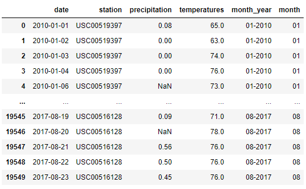

**Data analysis**
---

### Click Here to view solution:  [climate_analysis.ipynb](climate_analysis.ipynb)

2. Statictis for June's Precipitation and Temperture

3. Statictis for December's  Precipitation and Temperture

4. Side by Side June and December Precipitation
    1. Statitics
    2. box and whisker plot
    3. outliers
    
    
    
5. Side by Side June and December Temperture
    1. Statitics
    2. box and whisker plot
    3. outliers
    
    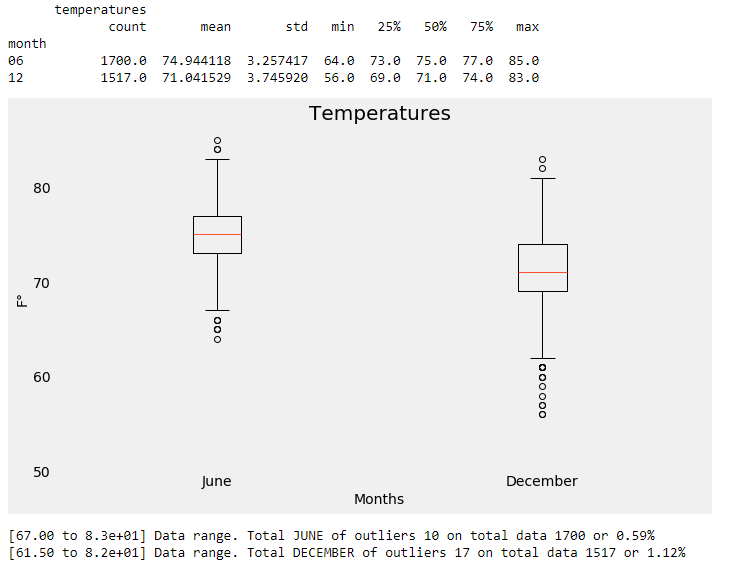
    
6. Further analysis
   
    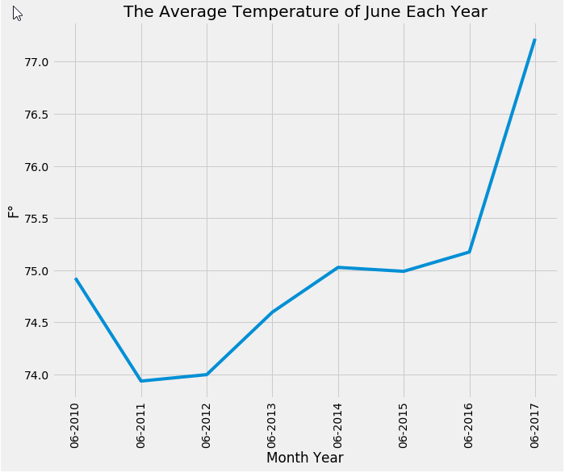
   
    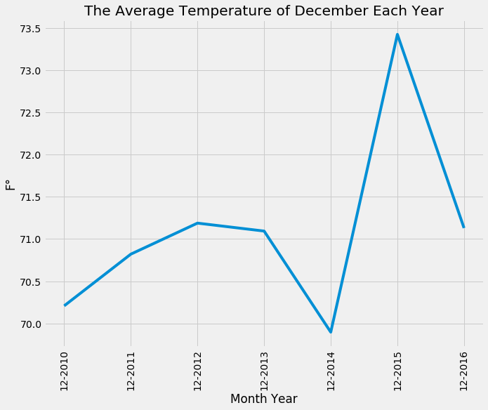
 
    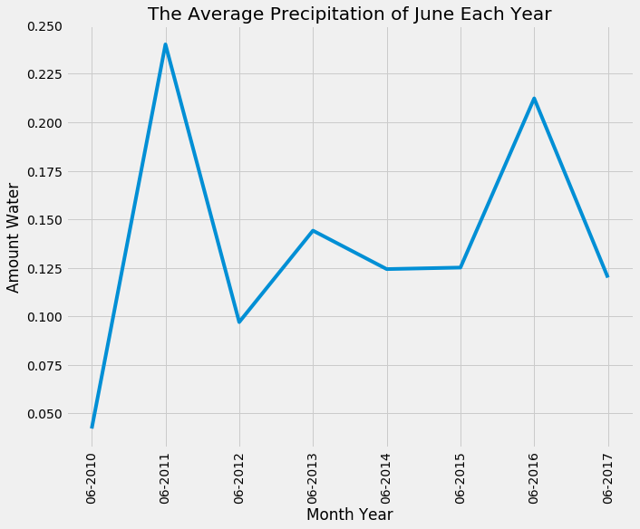
  
    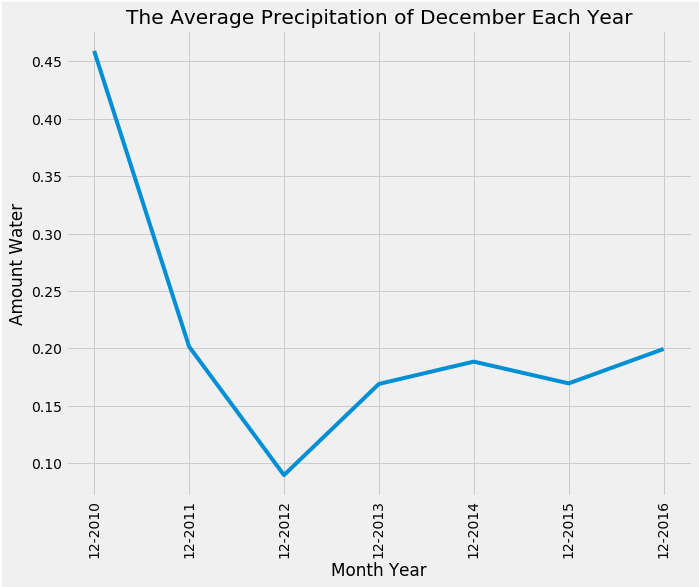
  
    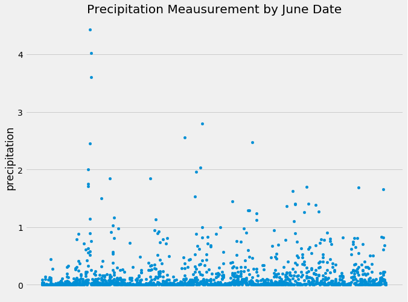
   
    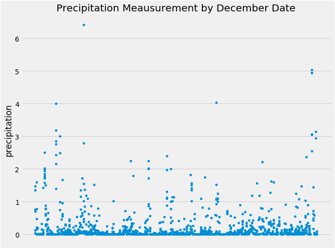
    
    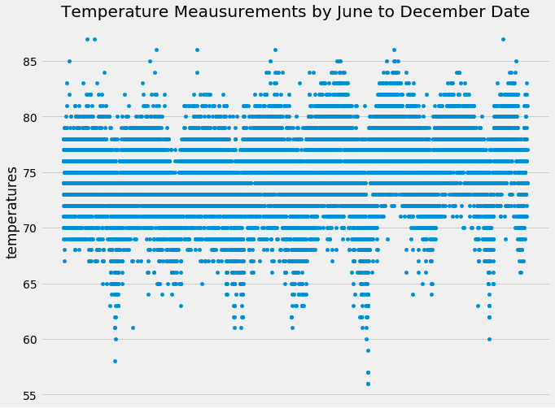
   
    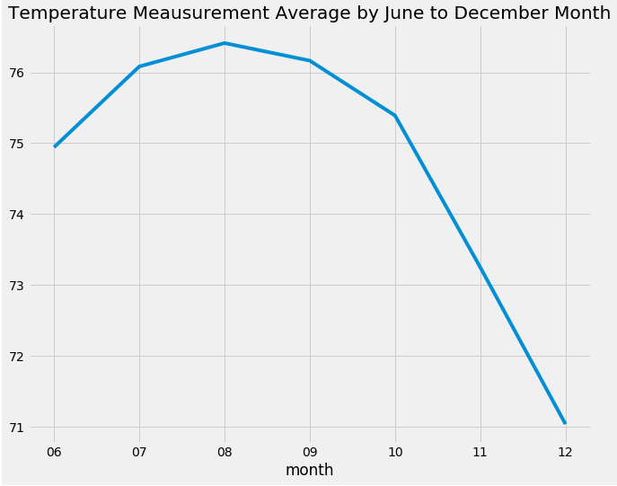
  
    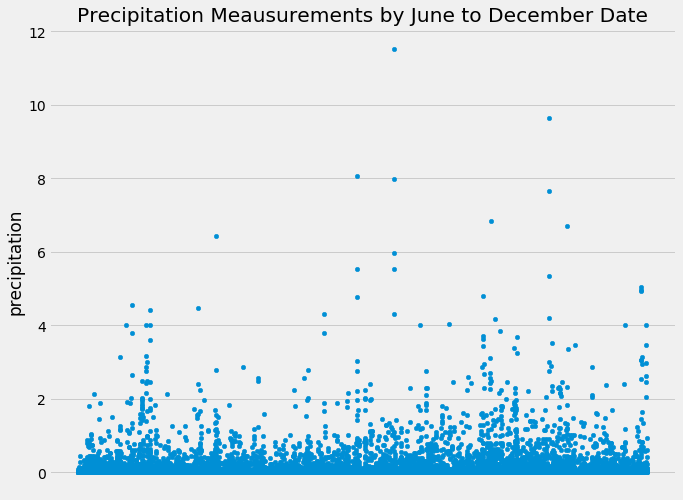
   
    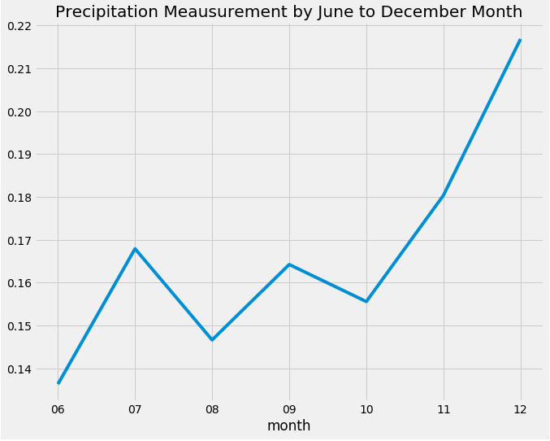
    
